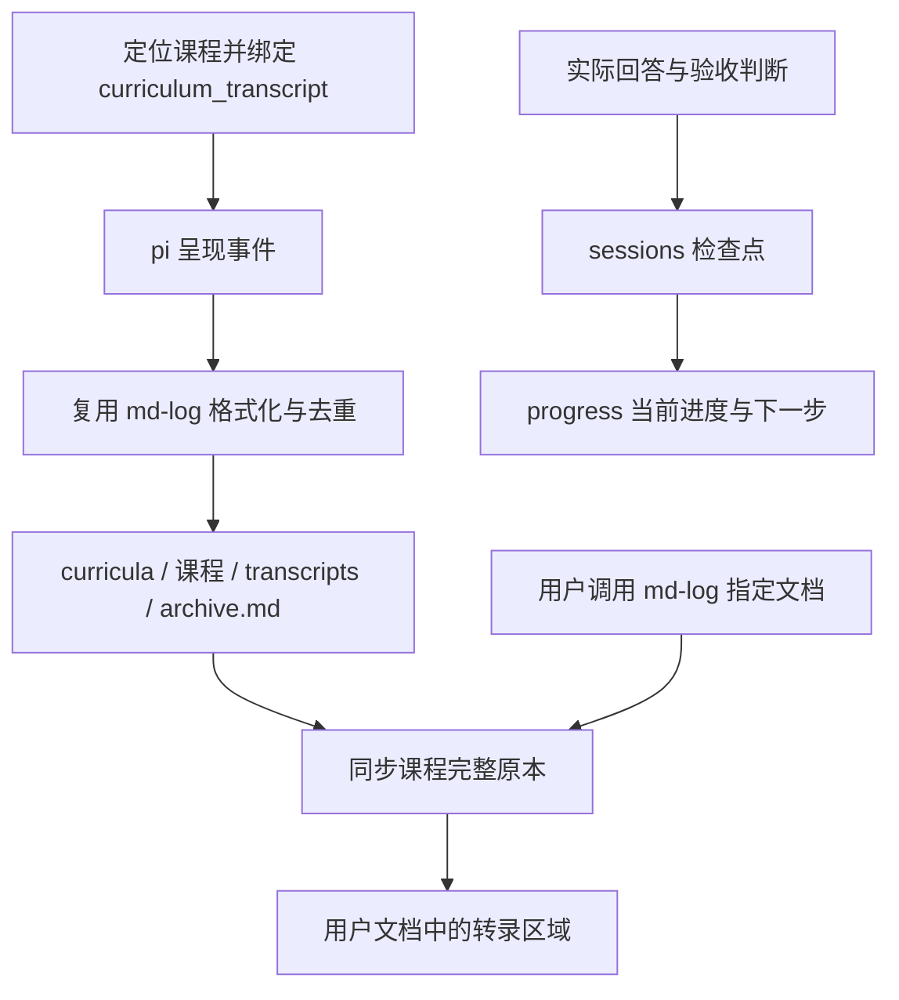

# 自动转录与阅读文档同步

创建课程、继续学习和排查转录时读取本文件。课程的路线、掌握证据与断点继续遵循 [persistence](persistence.md)；这里规定完整讲课资料如何自动保留，并交付到用户习惯使用的 Markdown 文档。

## 数据流与所有权



- `archive.md` 是这门课程呈现层的唯一原本，覆盖历次绑定该课程的会话，直接可读；不依赖仍在聊天上下文中的内容，也不是课程摘要。
- `state.json` 只存 `version`、稳定的转录 UUID 和用户明确指定的 `mirror` 绝对路径，未指定或解除时为 `null`。只有扩展写这两个文件，代理不手工追加讲课原文。
- 用户指定的 Markdown 是原本的单向阅读副本。同步只写该课程 UUID 对应的区域；区域外的前言、批注以及其他课程的区域保留。个人批注应写在区域外，不反向修改原本或学习状态。
- `progress.md` 仍是当前学习状态的权威文件；`sessions/` 是证据与恢复快照。原文已转录不等于已评估，更不等于单元完成。

采用**先写原本，再更新阅读副本**的顺序。无需对两个文件做双写事务，也无需维护可能与目标文件脱节的“已同步到第几条”游标。每次用完整原本生成该课程的阅读区域，稳定事件 ID 防止源事件重复，区域 UUID 防止历史回填重复。

## 启用与会话边界

1. 按 SKILL 的课程定位规则选择目录，创建或读取真实的 `course.md`。不要由扩展猜测最近使用的教材。
2. 在首次呈现计划、诊断、讲课前，代理调用工具：

   ```json
   { "course_dir": "E:/Learning/curricula/my-course" }
   ```

   工具名是 `curriculum_transcript`。调用会立即初始化自动转录，回填当前用户请求以来的可读内容，并恢复该课程此前明确绑定的阅读文档。它不会替用户选择外部文档。
3. 每次新聊天续学都自动调用一次；同一课程重复绑定保持原来的起点。pi 重启、reload、恢复会话和树导航根据**实际活动分支**中的绑定恢复。新聊天没有绑定时不猜课程，也不沿用另一会话的内存状态。
4. 切换课程时绑定新课程；明确离开课程开展其他工作时调用 `{ "course_dir": null }`。普通暂停和会话结束保留课程偏好，下一次绑定同一课程时继续同步。用户转向其他话题的那条输入可能已被原课程捕获，工具调用之后的内容按新绑定归属。
5. 只读查看进度不必新建转录或检查点；已有绑定在正常运行时仍记录可见对话。

工具成功返回 `archive`、`mirror` 和可能的 `mirrorError`。原本可写而阅读副本失败时，说明同步暂未完成，学习仍可继续且原文持续保存。如果原本初始化/写入失败，先修复保存问题再继续讲课。若工具不在环境中，说明项目扩展未加载，使用 pi 的 `/reload` 或启动时加载项目扩展后再绑定；不要声称已自动转录，也不要要求用户靠手动 `/md-log` 弥补缺失的自动记录功能。

## 用户命令与持久化语义

```text
/md-log "E:/Notes/强化学习.md"
/md-unlog
```

- 延续现有接口：`md-log` 接受已存在的 `.md` 文件，不自动创建外部目录；带空格的路径可加双引号。目标必须位于 `curricula/` 和课程目录之外，课程档案、路线、单元、进度、源缓存、检查点与转录原本均不能作为目标。
- 第一次链接同步**整门课程已存的全部内容**，包括之前从未调用 `md-log` 的学习会话；之后每个可读事件都继续保存原本并同步目标。
- 同一路径重复链接用于补齐和重试，不会重复追加课程区域。改为另一文件时，将完整原本同步到新文件，后续只更新新文件；旧文件保留在上次同步时的状态。每门课程同时维护一个目标。
- 若用户先在当前会话调用 `md-log`，再开始一门尚未绑定阅读文档的课程，沿用该明确指定的文件；该课程已有自己的目标时以课程目标为准。课程同步会合并已被课程原本完整覆盖的通用会话阅读区域，避免冻结的副本留在文档末尾，让人误以为实时转录中断。通用会话的原本仍保留在 `curricula/.md-log/`。
- 合并只处理具有有效首尾标记、正确内容哈希和标准“会话转录”标题的生成区域。所有正文事件的 ID **与正文**都必须已存在于课程原本；会话标题因绑定起点不同而使用不同事件 ID 时，只允许完整标题正文一致。包含额外对话、格式不同的历史正文、个人修改或损坏标记的区域继续保留；区域外内容和其他课程区域保持原样。课程绑定、恢复、实时同步和再次 `md-log` 都执行同一检查。
- `/md-unlog` 仅清除课程的外部同步绑定，自动转录继续。解除期间及后续未链接会话的内容，在下一次链接时一起补齐。
- 同一个目标可以含多门课程，各自更新自己的区域。课程模式之外仍支持通用 `/md-log`，其会话原本存放于 `<learning-root>/curricula/.md-log/<pi-session-id>/`；通用模式的 `/md-unlog` 停止该会话镜像。

## 记录内容与同步处理

记录用户文字、助手可见讲解、公式、代码块、Markdown/Mermaid、测验和偏好问题以及实际返回的回答与反馈。系统注入的 SKILL 原文折叠为加载提示；思考过程、普通文件/终端工具输入输出及课程内部快照不进入呈现层。

`message_end` 在一条消息完成时保存文字，不等待整次学习结束。`ask_user_question` 在 `tool_call` 时保存题面；`quiz` 在 `tool_execution_update` 时保存**实际打乱后的选项顺序**，不写工具参数中的答案键与解析。回答后才从 `tool_result` 写反馈。取消、不可用、出错和“不知道”分别记录，不能伪装成答错或掌握。重放旧记录时优先使用结果中保存的真实选项顺序；缺失时明确标记顺序未知，不能用出题顺序冒充。

消息的角色、时间戳及可读正文形成稳定标识；问题与回答分别使用工具调用 ID。重启、回填和事件重试复用这些标识。已记录的聊天分支内容作为实际学习历史保留，导航到另一分支不会删除它或回退掌握状态；补取 pi 历史时只读取实际活动分支，不能把“最后写入的条目”当作活动叶节点。

常规相对 Markdown 链接在捕获时转换为文件 URL；`visualize` 在项目 `viz/` 生成的可定位图片嵌入也转换为标准 Markdown 图片，使外部阅读文档不必与课程同处一个 Obsidian vault。公式、内联代码、围栏代码不改写。未知 wiki 目标保留原样，`|500` 作为图片替代文本保留而非保证跨渲染器宽度。此机制不复制二进制资源到外部目录，文件须仍可访问，阅读器须支持本地文件 URL。

教材出处使用 [教材引用与注解协议](citations.md)：正文放标准 `book-` 脚注，定义保存来源链接和 `textbook-ref:v1` JSON。每个呈现事件的脚注 ID 加上该事件完整 SHA-256 的命名空间，引用与定义同步改写，防止历次会话、题面与反馈重名；历史回放保持相同 ID。HTML 注释中的元数据原样保留，不参与链接或脚注改写。普通脚注与代码示例保持原样。

讲解与反馈各自必须携带完整脚注定义。扩展忠实保存模型给出的引用，不从自然语言页码推测位置或补造元数据；旧转录内容不自动迁移，避免破坏原文、稳定事件标识及用户文档的内容哈希。

## 失败、重试与旧课程

原本和目标更新均通过同目录临时文件及原子替换完成，先完成原本再操作目标。保存仍以原框架的**每门课程一个写入会话**为前提，不提供多个 pi 进程同时写同一门课程/同一目标的协调。

目标不可写、被删除或临时不可访问时，保留原本与目标绑定，并显示错误；下一条事件、会话恢复或再次 `/md-log` 会重试。原本写入失败时错误同样可见；可从仍然存在的 pi 分支历史补取已完成消息。目标成功而绑定元数据写入前异常退出时，再次链接同一文件仍是幂等的。

每个生成区域的开始标记保存内容 SHA-256。同步前验证原区域；若用户修改了区域内部正文，或破坏了首尾标记，就保留目标并报告冲突，原本继续增长。将个人修改移到区域外、恢复原生成区域，或另选阅读文档后重试。换行符的 LF/CRLF 规范化不视为内容修改。不要为了消除冲突覆盖整份用户文档。

旧课程无需重建路线、重置进度或改写旧检查点；下次绑定时即创建自动转录文件。**升级前未保存的原话不能由检查点摘要重建。** 若保留了该课程的旧 pi 会话，可按时间顺序打开，核对整条活动分支属于该课程后，用工具的显式历史模式导入：

```json
{ "course_dir": "E:/Learning/curricula/my-course", "history": "branch" }
```

导入仍去重，仍遵循原本先写、目标后同步；不会写学习状态。混合了无关工作的旧聊天不能整支导入。旧版外部转录若无新版管理标记，保留其正文，再追加新版区域；不要擅自删除旧正文来“消重”。

完整性保证从成功绑定且扩展运行时开始，覆盖所有已捕获的呈现事件。进程在消息完成前被强制终止的流式尾部，以及已经丢失且没有原始记录的旧讲课，不作无依据的完整性承诺。正常使用无需在每次学习或结束时手动保存。
